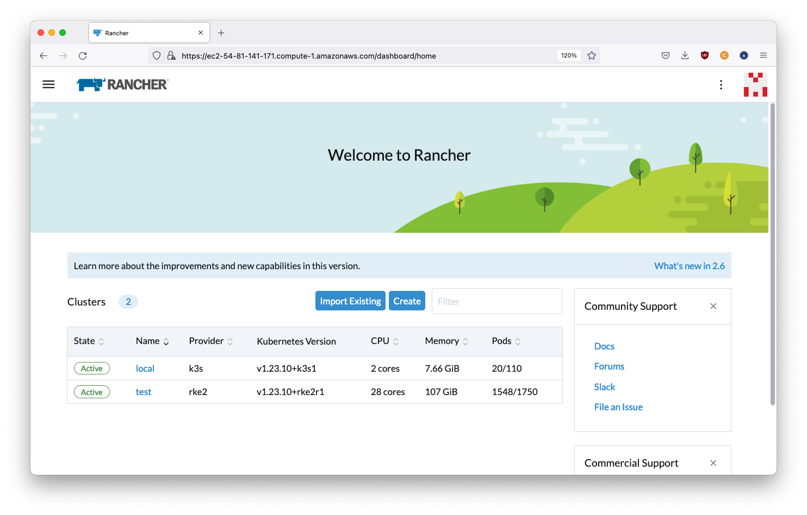
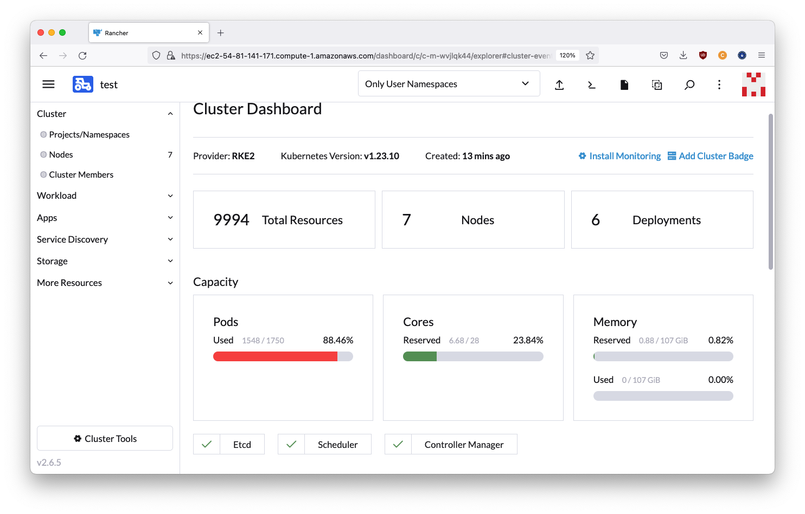
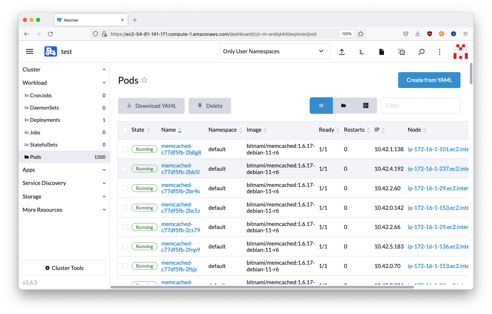

# 2022-09-23 - 250 pods per node test

## Results

- a 7 node RKE2 cluster with a maximum of 250 pods per node was set up and registered to a Rancher instance
- a deployment with 1500 memcached replica pods was added
- After a transitory period
  - ~220 pods per node are active
  - the cluster-pod association is stable
  - all node health checks are green in the Rancher UI
  - all pod health checks are passing (no error events are produced in the Rancher UI)

The test takes ~30 minutes and costs ~1 USD in AWS resources.

## Screenshots






## AWS Hardware configuration

- Rancher cluster/bastion host: 1-node t3.large, 50 GiB EBS gp3 root volume
- downstream cluster: 7-node t3.xlarge, 50 GiB EBS gp3 root volume
- networking: one /16 AWS VPC with two /24 subnets
  - public subnet: contains one bastion host which exposes three ports to the Internet via security groups
  - private subnet: contains all other nodes. Traffic allowed only internally and to/from the bastion

See https://aws.amazon.com/ec2/instance-types/, https://aws.amazon.com/ebs/, https://aws.amazon.com/vpc/ 

## Software configuration

- bastion host: Rancher 2.6.5 on a single-node k3s v1.23.10+k3s1 based on SLES 15 SP4
- downstream cluster: RKE2 v1.23.10+rke2r1, 3 server nodes and 4 agent nodes
  - all nodes based on Rocky Linux 8.6

***Important note***: setting the number of pods per node [in the RKE2 configuration file seems broken](https://github.com/rancher/rke2/issues/3378).

In order to conduct the test the number of pods was set via a systemd override on the command line arguments instead as a workaround.

See [the rke2 installation script in this repo](../rke2/install_rke2.sh) for details.

## Full configuration details

All infrastructure is defined via [Terraform](https://www.terraform.io/) files in the [20220923_250_pods_per_node](https://github.com/moio/scalability-tests/tree/20220923_250_pods_per_node) branch.

Note in particular [inputs.tf](../inputs.tf) for the main parameters.

## Reproduction Instructions
 
- get API access to EC2 configured for your terminal
    - for SUSE Engineering:
        - [have "AWS Landing Zone" added to your Okta account](https://confluence.suse.com/display/CCOE/Requesting+AWS+Access)
        - open [Okta](https://suse.okta.com/) -> "AWS Landing Zone"
        - Click on "AWS Account" -> your account -> "Command line or programmatic access" -> click to copy commands under "Option 1: Set AWS environment variables"
        - paste contents in terminal
- get [Terraform](https://www.terraform.io/downloads)
- check out this project
```shell
git clone https://github.com/moio/scalability-tests.git
cd scalability-tests
```
- run:

```shell
terraform init
terraform apply -auto-approve
```

- deployment takes ~10 minutes
- output will contain instructions to access the newly created clusters, eg.
```
To reach the Rancher UI use:

  https://ec2-AA-BB-CC-DD.compute-1.amazonaws.com

To reach the bastion host use:

  ./config/login_bastion.sh

To reach the Rancher cluster API use:

  kubectl --kubeconfig ./config/rancher.yaml
  helm --kubeconfig ./config/rancher.yaml
  k9s --kubeconfig ./config/rancher.yaml

To reach downstream cluster nodes use:

  ./config/login_node-1.sh
  ./config/login_node-2.sh
  ./config/login_node-3.sh
  ./config/login_node-4.sh
  ./config/login_node-5.sh
  ./config/login_node-6.sh
  ./config/login_node-7.sh
```
- use the URL to access the Rancher UI, login with `admin` as temporary password
- "Clusters" -> "Import existing" -> "Generic" -> "Cluster Name": test -> "Create"
- click on the `curl` command to copy it
- SSH into the first node running `./config/login_node-1.sh`
- paste the `curl` command to register the cluster to Rancher
- wait until the cluster is fully registered, check that all 7 nodes are detected
- Homepage -> test -> "Apps" -> "Repositories" -> "Create"
    - "Name": bitnami
    - "Index URL": `https://charts.bitnami.com/bitnami`
    - click on "Create"
- "Apps" -> "Charts" -> "memcached"
    - "Chart Versions": 6.2.5
    - click on "Install"
    - "Name": memcached
    - click on "Next" -> "Install"
    - "Workload" -> "Deployments" -> memcached -> "⋮" -> "Edit YAML"
    - "Edit YAML":
        - `spec.replicas`: change from 1 to 1500
        - remove the `resources` dictionary (`resources:` line and the three following lines) 
    - click on "Save"
- wait for deployment to stabilize (it could take several minutes) and check events on the "Cluster Dashboard" page, there should not be errors after the cluster settles at ~1550 / 1750 active pods

All created infrastructure can be destroyed via:
```shell
terraform destroy -auto-approve
```

## Troubleshooting
- to re-create the downstream cluster use:

```shell
terraform state list | egrep '(rke2)|(nodes)' | xargs -n1 terraform taint
terraform apply
```

- if the error below is produced:
```
Error: creating EC2 Instance: VcpuLimitExceeded: You have requested more vCPU capacity than your current vCPU limit of 32 allows for the instance bucket that the specified instance type belongs to. Please visit http://aws.amazon.com/contact-us/ec2-request to request an adjustment to this limit.
```

Then you need to request higher limits for your account to AWS. This can be done by visting [the Service Quotas](https://console.aws.amazon.com/servicequotas/home) page and filling the details to request an increase of the "Running On-Demand Standard (A, C, D, H, I, M, R, T, Z) instances" limit.
